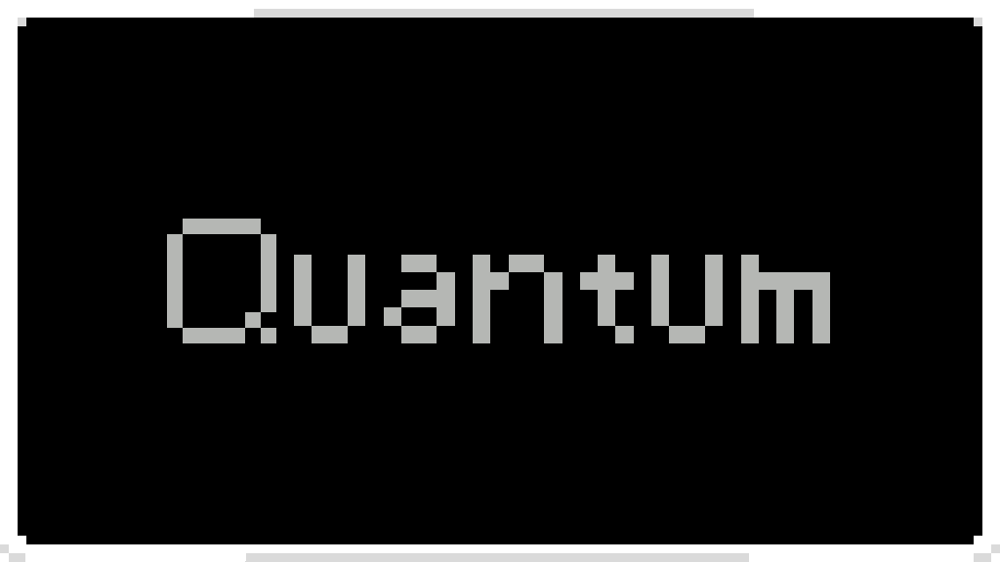

# Quantum（量子）

《Casualties Unknown》的便捷功能模组，添加合成搜索、容器整理、枪械修改和玩法调整 — 全部可在游戏内 **Quantum** 选项标签页中配置。

## 功能

### 合成与信息
- **Ctrl + Shift 悬停** — 展开物品详细信息（合成配方、可用标志、无视抑郁等）
- **拼音搜索** — 用拼音首字母（`bd` → 绷带）或全拼搜索合成配方

### 物品栏
- **容器整理** — 按名称 / 价值 / 重量排序（升序 / 降序）
- **总价值显示** — 在物品栏重量旁显示当前物品总价值

### HUD
- **弹药显示** — 在枪械菜单上方实时显示当前/最大弹量（菜单/暂停时自动隐藏）

### 枪械修改
- 自动上膛、不毁枪械、无限弹药、永不卡壳、无弹壳、无后座力

### 玩法
- **收藏品耐久警报** — 收藏物品耐久每下降 5% 提醒一次
- **双语物品名** — 在物品原名后附加指定语言的翻译
- **无观察者** — 禁用观察者
- **不排泄** — 昏迷时不再排泄
- **Tab / Esc** — 一键关闭所有打开的 UI 面板

### 控制台
- **Tab 自动补全** — 带可滚动候选列表
- **Ctrl+Z** 撤销历史
- **历史记录上限** 可配置

## 设置

所有选项位于游戏设置菜单的 **Quantum** 标签页（由 CUCoreLib 驱动），修改即时生效。

## 依赖

- [BepInEx 5](https://github.com/BepInEx/BepInEx)
- [CUCoreLib](https://github.com/CNCUMC/CUCoreLib) ≥ 1.0.1
- [Bark](https://github.com/CNCUMC/Bark) ≥ 1.0.0

## 安装

1. 将 BepInEx、CUCoreLib 和 Bark 安装到游戏目录。
2. 将 `Quantum.dll` 和 `TinyPinyin.dll` 复制到 `BepInEx/plugins/Quantum/`。
3. 启动游戏，设置菜单中出现 **Quantum** 标签页。

## 本地化

内置简体中文和英文。添加更多语言：
1. 在游戏内控制台运行 `createLocale` 生成 `EN.json`（位于 `BepInEx/config/CUCoreLib/Locales/`）。
2. 复制 `EN.json` → `{语言代码}.json`，翻译其中的值，重启游戏即可。

## 许可证

MIT
